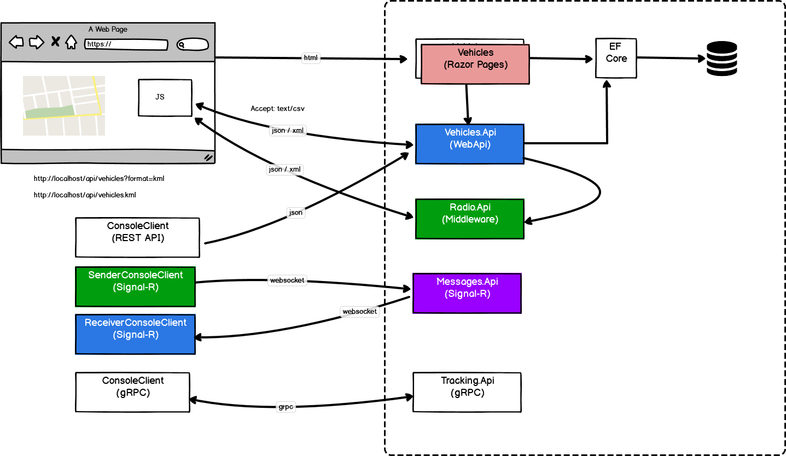

# .NET Core 3.1 + EF Core 3.1

## Struktura projektu

| Projekt | Opis | Framework  |
|---|---|---|
|  Vehicles.RazorPages | Aplikacja webowa do zarządzania pojazdami | Razor Pages  |
|  Vehicles.Api | Usługa sieciowa do zarządzania pojazdami | WebApi  |
|  Radio | Usługa do obsługi radionadajników | Middleware  |
|  Messages | Hub do komunikacji między osobami | Signal-R  |

